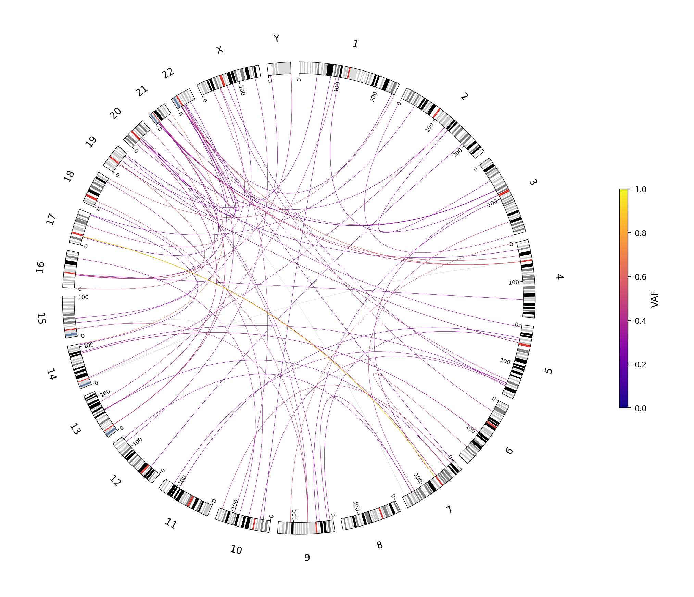
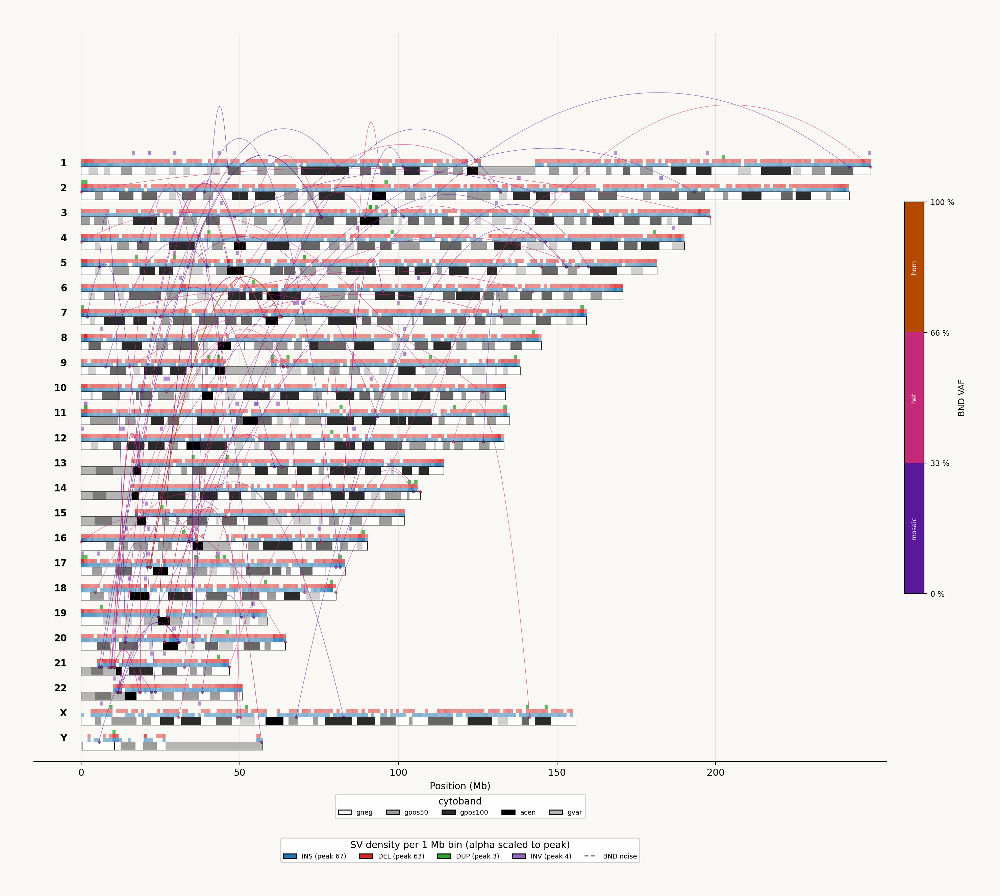

<p align="center"></p>

# molamola

A Python plotting tool for Oxford Nanopore variation data.
**One input in, one self-contained HTML report out.**

molamola picks the right plot type from its input — VCF modes are
auto-detected from the header, the karyotype mode is selected by
the `--mosdepth` flag:

- **SV / cytogenetics report** for long-read SV VCFs
  (Sniffles2, cuteSV, SVIM, pbsv, NanoVar).
- **Per-gene phased-haplotype panels** for compound-het workup
  from phased + VEP-annotated small-variant VCFs
  (WhatsHap, HiPhase).
- **Karyotype coverage report** for a mosdepth `regions.bed.gz`
  (via `--mosdepth`) — genome-wide CN scatter + rolling-median
  smooth, with an optional BAF panel beneath when paired with a
  small-variant VCF.

## Install

```sh
pip install molamola
```

Or via conda — note that both bioconda and conda-forge channels are
needed (pycirclize lives on conda-forge):

```sh
conda create -n molamola -c bioconda -c conda-forge molamola
```

## Quick start

```sh
molamola --vcf sample.vcf --out reports/
# or, for a coverage karyotype:
molamola --mosdepth sample.regions.bed.gz --reference hg38 --out reports/
```

The plot type is picked from the input (VCF header, or `--mosdepth`
for karyotype mode). `--out` is required — molamola refuses rather
than silently writing the report next to the input file. Output is
a single self-contained HTML report — figures embedded as base64,
no external assets, opens offline.

## Example output

Figures below come from running molamola's SV mode on sample MH001
(ONT LSK114 library prep, aligned-read N50 10.4 kb, median autosomal
coverage 54x). The HTML report embeds both plots back-to-back; shown
separately here for clarity.

### Circos plot



22 autosomes plus X and Y arranged around the disc, with greyscale
ISCN cytobands on the rim. Each ribbon across the disc is a BND
(translocation or large rearrangement); ribbon colour encodes VAF
(purple = low → yellow = high, plasma colormap). At-a-glance view
for inter-chromosomal events.

### Linear genome map



One row per chromosome (chr1 at top, chrY at bottom). Cytobands
embedded inside each chromosome track. Above each track sit four
1-Mb-bin density strips — INS = blue, DEL = red, DUP = green,
INV = purple — with alpha encoding per-bin event count. BND arcs
hang above the tracks, colour-encoded by VAF as in the circos.
Better for per-chromosome detail and density hotspots.

### Compound-het example

Pending.

## Preparing a phased VCF for compound-het mode

Compound-het mode needs both phasing (`PS` FORMAT field) and VEP
annotation (`CSQ` INFO field). A raw phased small-variant VCF —
e.g. straight Clair3 output — has the first but not the second,
and molamola will refuse it. Annotate with
[Ensembl VEP](https://github.com/Ensembl/ensembl-vep) first.

**1. Download the matching VEP cache once** (one-time, ~20 GB),
on a machine with internet:

```sh
wget https://ftp.ensembl.org/pub/release-105/variation/indexed_vep_cache/homo_sapiens_vep_105_GRCh38.tar.gz
```

If your VEP isn't 105, swap `105` for your release number (it
appears twice in the URL); the cache release must match the VEP
release exactly. Transfer to wherever you run VEP if that's a
different machine.

**2. Unpack into a stable cache directory:**

```sh
mkdir -p VEP_cache && cd VEP_cache
tar -xzf ../homo_sapiens_vep_105_GRCh38.tar.gz
# creates VEP_cache/homo_sapiens/105_GRCh38/
```

**3. Run VEP fully offline**, with `--canonical --symbol --pick`
so the CSQ shape matches what molamola consumes:

```sh
vep --input_file sample.phased.vcf \
    --output_file sample.phased.vep.vcf \
    --vcf --offline \
    --cache --dir_cache /path/to/VEP_cache \
    --assembly GRCh38 \
    --fasta /path/to/hg38.fa \
    --canonical --symbol --pick \
    --force_overwrite
```

Then `molamola --vcf sample.phased.vep.vcf --out reports/` picks
it up as compound-het mode.

**Notes on VEP.** VEP is third-party software (Ensembl); molamola
does not bundle or wrap it. The cache release and VEP binary
release must match exactly — a mismatch leads to silent
mis-annotation rather than a clean error. Compound-het mode reads
VEP's `Consequence`, `SYMBOL`, and `CANONICAL` fields as-is; any
quirks of a particular VEP build are inherited. `--pick` reduces
multi-transcript CSQ entries to one per variant.

## Bundled references

molamola ships its own reference data inside `molamola/data/`:

- `cytoBand.txt.gz` (hg38) and `cytoBand.t2t.txt.gz`
  (T2T-CHM13v2.0) — UCSC cytoband annotations, used for the SV
  ideogram tracks.
- `canonical_exons.hg38.tsv.gz` — MANE Select v1.x canonical
  transcripts and exon coordinates, used for the compound-het
  exon track.
- `clinvar.hg38.tsv.xz` — molamola's reduced ClinVar TSV
  (chrom, pos, ref, alt, significance bucket; xz-compressed).
  The release date of the bundled snapshot is logged in each
  HTML report's run-metadata.

Bundled-only by design: molamola does not auto-download or look up
online. Override with `--clinvar PATH` or
`--canonical-exons PATH` if you want a fresher snapshot. The two
reduced TSVs are reproducibly regeneratable from public sources
via `scripts/derive_canonical_exons.py` and
`scripts/derive_clinvar_for_molamola.py` in the repo.

## Documentation

- [CLI reference](CLI.md) — every flag, with defaults and meanings.
- [Examples](EXAMPLES.md) — worked commands for each plot type.
- [Filters](FILTERS.md) — noise heuristics, focus windows, ClinVar gating.
- [Output spec](OUTPUTS.md) — what's in the HTML; how figures are encoded.

## Source

- Repo: [github.com/martinandclaude/molamola](https://github.com/martinandclaude/molamola)
- PyPI: [pypi.org/project/molamola](https://pypi.org/project/molamola/)
- Changelog: [CHANGELOG.md](https://github.com/martinandclaude/molamola/blob/main/CHANGELOG.md)
- Issues: [github.com/martinandclaude/molamola/issues](https://github.com/martinandclaude/molamola/issues)
