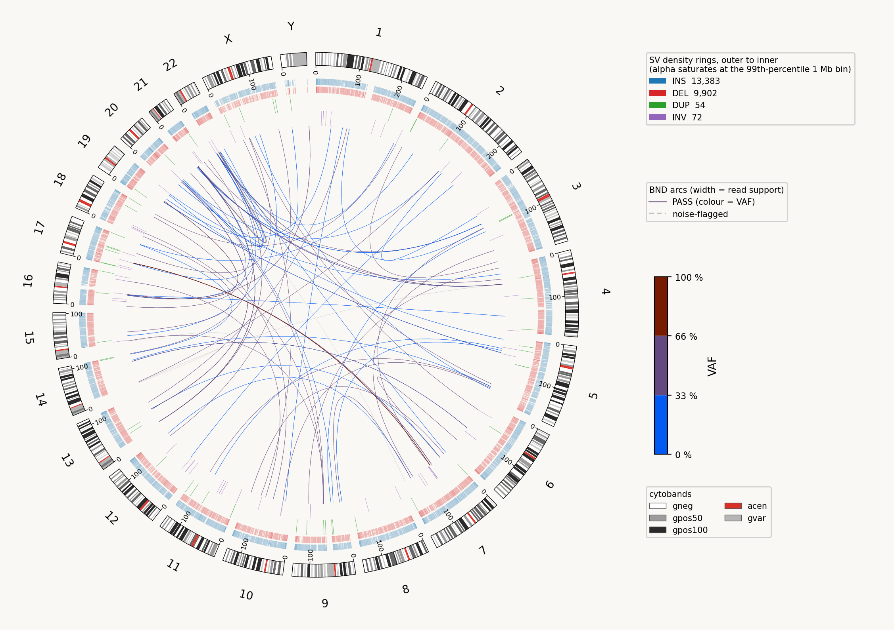
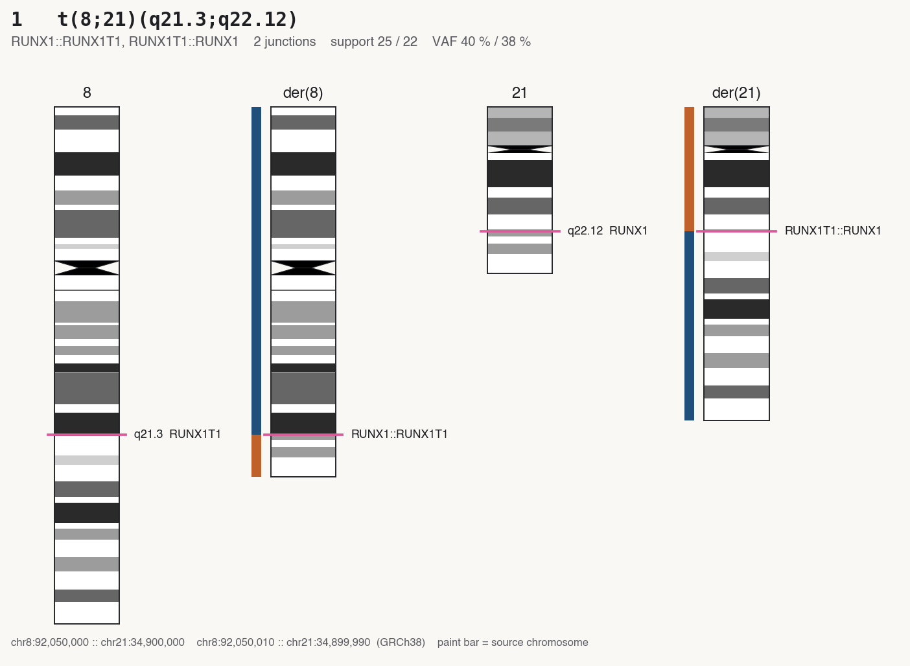

<p align="center"></p>

# molamola

A Python cytogenetics plotting tool for Oxford Nanopore data.
**One input in, one self-contained HTML report out.**

molamola picks the right report from its input — SV mode is
auto-detected from the VCF header, karyotype mode is selected by
the `--mosdepth` flag:

- **SV / cytogenetics report** for long-read SV VCFs
  (Sniffles2, cuteSV, SVIM, pbsv, NanoVar): a circos of
  rearrangements and SV density, and a derivative-chromosome panel for
  each candidate balanced rearrangement, with breakpoint bands, genes
  and fusions.
- **Karyotype coverage report** for a mosdepth `regions.bed.gz`
  (via `--mosdepth`) — genome-wide log2 relative-depth scatter + rolling-median
  smooth, with an optional BAF panel beneath when paired with a
  small-variant VCF.

## Install

```sh
pip install molamola
```

Or via conda — note that both bioconda and conda-forge channels are
needed (pycirclize lives on conda-forge):

```sh
conda create -n molamola -c bioconda -c conda-forge molamola
```

## Quick start

```sh
molamola --vcf sample.vcf --out reports/
# targeted / adaptive-sampling run: only chromosomes with a rearrangement
molamola --vcf sample.vcf --only-sv-chroms --out reports/
# or, for a coverage karyotype:
molamola --mosdepth sample.regions.bed.gz --reference hg38 --out reports/
```

The plot type is picked from the input (VCF header, or `--mosdepth`
for karyotype mode). `--out` is required — molamola refuses rather
than silently writing the report next to the input file. Output is
a single self-contained HTML report — figures embedded as base64,
no external assets, opens offline.

## Example output

The circos below comes from running molamola's SV mode on sample MH001
(ONT LSK114 library prep, aligned-read N50 10.4 kb, median autosomal
coverage 54x).

### Circos plot



22 autosomes plus X and Y arranged around the disc, with greyscale
ISCN cytobands on the rim and a red centromere. Inside the rim sit
four 1-Mb-bin SV density rings -- INS, DEL, DUP, INV, outermost
first -- so located events read on the rings while connections read
across the disc. Each ribbon across the disc is a rearrangement:
junctions are paired into translocations, inversions and insertions,
and candidates -- both junctions found, outside repeats -- are drawn
widest, numbered on the disc and named beside it in ISCN form. Single
junctions, most of a normal genome's arcs, stay faint. Ribbon colour
encodes VAF as one of three discrete classes -- blue 0-33 %, orange
33-66 %, near-black 66-100 % -- chosen to stay distinct under
colour-blindness. On this normal genome the only candidates are large
inversion calls, which are common polymorphisms or recurrent caller
artefacts.

### Derivative-chromosome panels



Below the circos, each candidate gets a panel in the form a
cytogeneticist reads a karyotype in: the normal chromosomes beside the
derivatives the junctions build, breakpoints labelled with band and
gene, and junctions with the fusion they make (5'::3'). Shown here for
synthetic t(8;21) breakpoints -- an illustration, not a sample.

## Bundled references

molamola ships its own reference data inside `molamola/data/`:

- `cytoBand.txt.gz` (hg38) and `cytoBand.t2t.txt.gz`
  (T2T-CHM13v2.0) — UCSC cytoband annotations, used for the SV
  ideogram tracks.
- `exclusion.hg38.bed.gz`, `exclusion.t2t.bed.gz` — karyotype-mode
  exclusion masks (low-mappability ∪ polymorphic-TR catalog),
  built from 500 bp runs.
- `gc_10kb.hg38.bed.gz`, `gc_10kb.t2t.bed.gz` — 10 kb GC tables
  driving karyotype mode's per-1 % GC-bucket median-ratio
  correction.
- `genes.hg38.bed.gz`, `genes.t2t.bed.gz` — protein-coding genes and
  the IG / TR loci for breakpoint and fusion labels, from NCBI RefSeq
  annotation release RS_2025_08 (native on both builds, same symbols).

Bundled-only by design: molamola does not auto-download or look up
online. The bundled refs are reproducibly regeneratable from public
sources via `scripts/derive_karyotype_refs.py` and
`scripts/derive_gene_tables.py` in the repo.

> **Upgrading from 0.6:** the SV report's linear genome map is gone,
> so `--png` no longer writes `<sample>.report.sv_map.png`; it writes
> the circos and one `<sample>.report.rearrangement_<n>.png` per
> candidate panel instead.

> **Compound-het mode was removed after v0.5.1.** The per-gene
> phased-haplotype panels for recessive-disease workup, and the
> bundled ClinVar and MANE Select references they needed, are gone.
> molamola is a cytogenetics tool now. Install `molamola==0.5.1`
> if you need them.

## Documentation

- [CLI reference](CLI.md) — every flag, with defaults and meanings.
- [Examples](EXAMPLES.md) — worked commands for each report type.
- [Filters](FILTERS.md) — noise heuristics, rearrangement tiers, focus windows, mask and GC handling.
- [Output spec](OUTPUTS.md) — what's in the HTML; how figures are encoded.

## Source

- Repo: [github.com/martinandclaude/molamola](https://github.com/martinandclaude/molamola)
- PyPI: [pypi.org/project/molamola](https://pypi.org/project/molamola/)
- Changelog: [CHANGELOG.md](https://github.com/martinandclaude/molamola/blob/main/CHANGELOG.md)
- Issues: [github.com/martinandclaude/molamola/issues](https://github.com/martinandclaude/molamola/issues)
